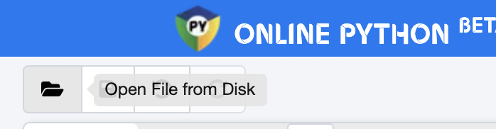
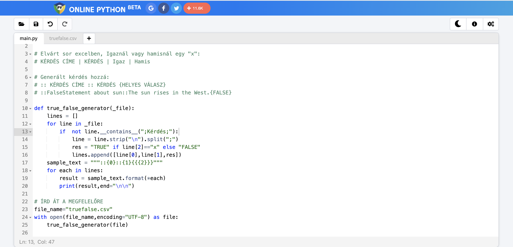
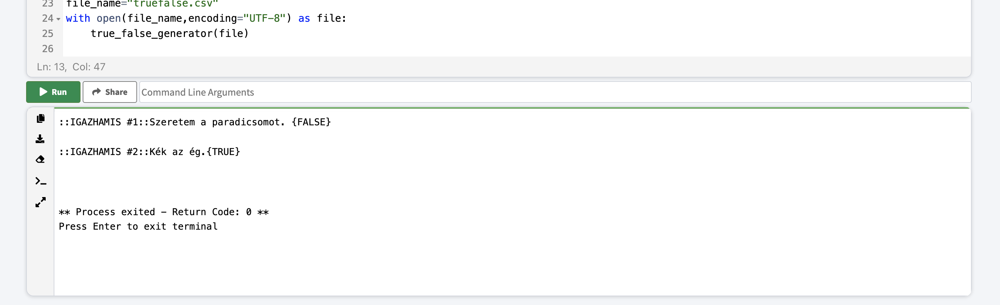
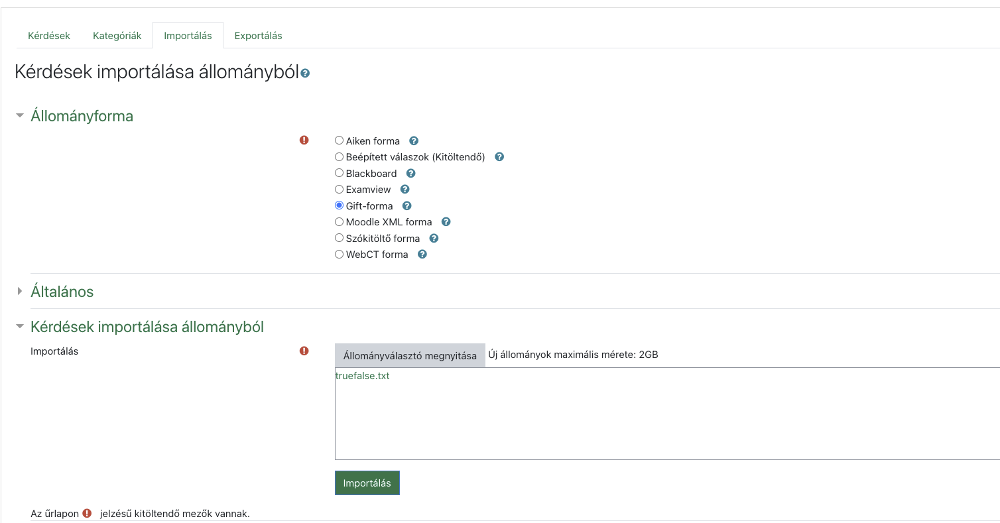

# Igaz-Hamis kérdések

## 1. lépés: EXCEL

Excelben a következő oszlopok legyenek, "x"-szel jelölve a helyes választ: 

| KÉRDÉS CÍM | KÉRDÉS | Igaz | Hamis |
| --|--|--|--|
| IGAZHAMIS #1|Waste management includes several methods.|x||
| IGAZHAMIS #2| Recycling means burying waste in a hole.||x|

## 2. lépés: Konvertálás CSV-be

Az előző lépésben létrehozott XLS/XLSX fájlt exportáljuk CSV-be: https://support.microsoft.com/en-us/office/import-or-export-text-txt-or-csv-files-5250ac4c-663c-47ce-937b-339e391393ba
Valahogy így kell kinéznie, ha megnyitjuk a Jegyzettömb/Notepad alkalmazásban:
```
TITLE;Kérdés;Igaz;Hamis
IGAZHAMIS #1;Szeretem a paradicsomot. ;;x
IGAZHAMIS #2;Kék az ég.;x;
```

## 3. lépés: GIFT formátum generálása

Nyissuk meg az https://www.online-python.com/ oldalt.

[Ezt a kódot](truefalse.py) másoljuk be ide, és az "Open file from Disk" gomb segítsével nyissuk meg a 2. lépésben létrehozott CSV fájlt. 

**Figyeljünk arra, hogy a `truefalse.csv` fájlnév helyett az szerepeljen a kódban, ahogy a feltöltött fájlt hívják.**



```
def true_false_generator(_file):
    lines = []
    for line in _file:
        if  not line.__contains__(";Kérdés;"):
            line = line.strip("\n").split(";")
            res = "TRUE" if line[2]=="x" else "FALSE"
            lines.append([line[0],line[1],res])
    sample_text = """::{0}::{1}{{{2}}}"""
    for each in lines:
        result = sample_text.format(*each)
        print(result,end="\n\n")

# ÍRD ÁT A MEGFELELŐRE
file_name="truefalse.csv"
with open(file_name,encoding="UTF-8") as file:
    true_false_generator(file)

```

Valahogy így kéne kinéznie az oldalnak:


Kattintsunk a Run gombra. Ha kész, másoljuk ki az alul kiírt, kész szöveget egy üres txt formátumú fájlba (notepad) és mentsük el:



```
::IGAZHAMIS #1::Szeretem a paradicsomot. {FALSE}

::IGAZHAMIS #2::Kék az ég.{TRUE}
```


## 4. lépés: Moodle

Az előbb elmentett txt fájt importáljuk be a Moodlebe/eLearningbe, figyelve arra, hogy a GIFT formátum legyen kiválasztva!

