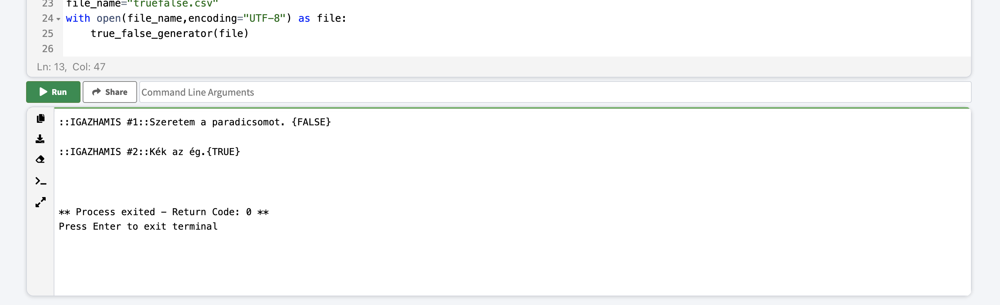
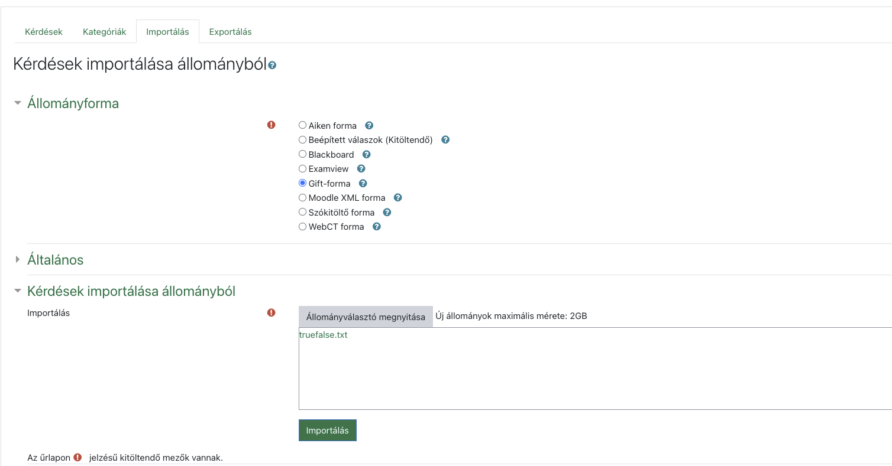

# MATCHING kérdések egy helyes válasszal

## 1. lépés: EXCEL

Excelben a következő oszlopok legyenek, tesztőleges számú rossz választ lehetséges megadni: 

| KÉRDÉS | A1  | a1 | A2 | a2 | ... |
| --         |    --  |--   | -- | -- | -- | 
|Match the following countries with their corresponding capitals.|Canada|Ottawa|Italy|Rome|...|

## 2. lépés: Konvertálás CSV-be

Az előző lépésben létrehozott XLS/XLSX fájlt exportáljuk CSV-be: https://support.microsoft.com/en-us/office/import-or-export-text-txt-or-csv-files-5250ac4c-663c-47ce-937b-339e391393ba
Valahogy így kell kinéznie, ha megnyitjuk a Jegyzettömb/Notepad alkalmazásban:
```
KÉRDÉS;A1;a1;A2;a2;A3;a3;A4;a4
Match the following countries with their corresponding capitals.;Canada;Ottawa;Italy;Rome;Japa;Tokyo;India;New Delhi
```

## 3. lépés: GIFT formátum generálása

Nyissuk meg az https://www.online-python.com/ oldalt.

[Ezt a kódot](main.py) másoljuk be ide, és az "Open file from Disk" gomb segítsével nyissuk meg a 2. lépésben létrehozott CSV fájlt. 

**Figyeljünk arra, hogy a `input.csv` fájlnév helyett az szerepeljen a kódban, ahogy a feltöltött fájlt hívják.**


```
def matching_generator(_file):
    lines = []
    for line in _file:
        if not line.__contains__(";KÉRDÉS;"):
            line = line.strip("\n").split(";")
            lines.append(line)
    sample_text = """{0}{{ """
    for each in lines:
        result = sample_text.format(each[0])
        for i in range(1,len(each),2):
            result+=" ="+each[i]+" -> " +each[i+1]
        result+=" }"
        
        print(result,end="\n\n")

# ÍRD ÁT A FILE NEVET!!
file_name="MATCHING/input.csv"
with open(file_name,encoding="UTF-8") as file:
    matching_generator(file)
(file)

```

Valahogy így kéne kinéznie az oldalnak:


Kattintsunk a Run gombra. Ha kész, másoljuk ki az alul kiírt, kész szöveget egy üres txt formátumú fájlba (notepad) és mentsük el:



```
Match the following countries with their corresponding capitals.{  =Canada -> Ottawa =Italy -> Rome =Japa -> Tokyo =India -> New Delhi }

```


## 4. lépés: Moodle

Az előbb elmentett txt fájt importáljuk be a Moodlebe/eLearningbe, figyelve arra, hogy a GIFT formátum legyen kiválasztva!
