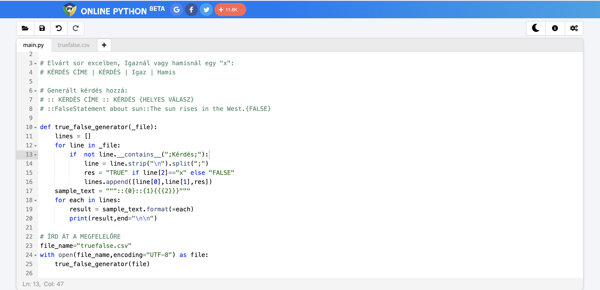

# MULTIPLE CHOICE kérdések egy helyes válasszal

## 1. lépés: EXCEL

Excelben a következő oszlopok legyenek, tesztőleges számú rossz választ lehetséges megadni: 

| KÉRDÉS CÍM | KÉRDÉS | Jó válasz | Rossz válasz 1 | Rossz válasz 2 | Rossz válasz 3 | ... | Rossz válasz N |
| --         |    --  |--         |--              | --             | --                |--|--|
|MULTIPLE CHOICE #1|The process of turning waste into new materials is called ... .|recycling|landfilling|composting|incineration|||
MULTIPLE CHOICE #2|... means getting rid of waste.|disposal|reduction|reuse|decomposition||

## 2. lépés: Konvertálás CSV-be

Az előző lépésben létrehozott XLS/XLSX fájlt exportáljuk CSV-be: https://support.microsoft.com/en-us/office/import-or-export-text-txt-or-csv-files-5250ac4c-663c-47ce-937b-339e391393ba
Valahogy így kell kinéznie, ha megnyitjuk a Jegyzettömb/Notepad alkalmazásban:
```
KÉRDÉS CÍM;KÉRDÉS;Jó válasz;Rossz válasz 1;Rossz válasz 2;Rossz válasz 3
MULTIPLE CHOICE #1;The process of turning waste into new materials is called ... .;recycling;landfilling;composting;incineration
MULTIPLE CHOICE #2;... means getting rid of waste.;disposal;reduction;reuse;decomposition
```

## 3. lépés: GIFT formátum generálása

Nyissuk meg az https://www.online-python.com/ oldalt.

[Ezt a kódot](multiple_choice_1.py) másoljuk be ide, és az "Open file from Disk" gomb segítsével nyissuk meg a 2. lépésben létrehozott CSV fájlt. 

**Figyeljünk arra, hogy a `multiple_choice_1.csv` fájlnév helyett az szerepeljen a kódban, ahogy a feltöltött fájlt hívják.**


```
def multiple_choice_1_generator(_file):
    lines = []
    for line in _file:
        if  not line.__contains__(";Kérdés;"):
            line = line.strip("\n").split(";")
            lines.append(line)
    sample_text = """::{0}::{1}{{={2} """
    for each in lines:
        result = sample_text.format(*each)
        for wrong in each[3:]:
            result+="~"+wrong+" "
        result+="}"
        
        print(result,end="\n\n")

# ÍRD ÁT A FILE NEVET!!
file_name="multiple_choice_1.csv"
with open(file_name,encoding="UTF-8") as file:
    multiple_choice_1_generator(file)

```

Valahogy így kéne kinéznie az oldalnak:


Kattintsunk a Run gombra. Ha kész, másoljuk ki az alul kiírt, kész szöveget egy üres txt formátumú fájlba (notepad) és mentsük el:


```
::MULTIPLE CHOICE #1::The process of turning waste into new materials is called ... .{=recycling ~landfilling ~composting ~incineration }

::MULTIPLE CHOICE #2::... means getting rid of waste.{=disposal ~reduction ~reuse ~decomposition }
```


## 4. lépés: Moodle

Az előbb elmentett txt fájt importáljuk be a Moodlebe/eLearningbe, figyelve arra, hogy a GIFT formátum legyen kiválasztva!
